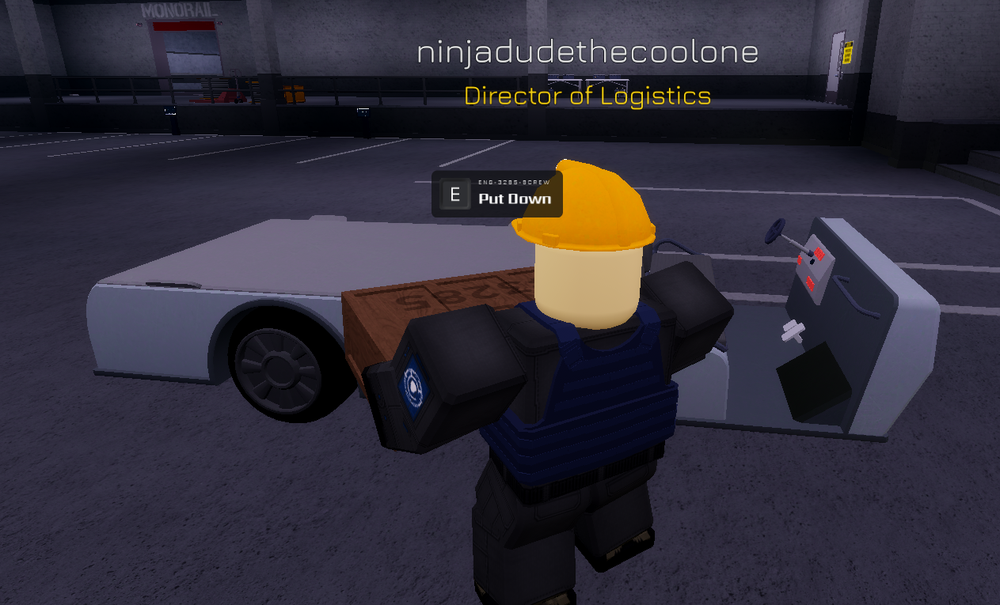
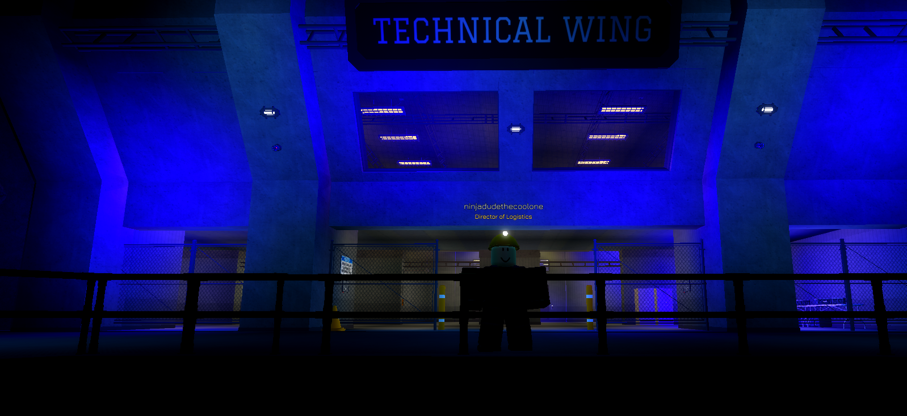

export const Highlight = ({children, color}) => (

{children}

);

The Logistics Department has a numerous amount of duties, spanning from restocking simple vending machines all the way to the transportation of important materials to actively maintain the functions of the installations and across its many sites. Below are the multiple assigned tasks that are responsible for being completed by Logistical personnel:

## Resource Transportation - <Highlight color="#ED820E"> Training Required </Highlight>
As a member of the Logistics Department you will primarily focus on the transportation of resources and supplying the Engineering & Technical Services with the parts required to uphold Dark Matter Reactor operations. There are specific places you must deliver the said materials, all listed below:

| Resource Transportation | Procedures | Locations |
| ----------------------- | ---------- | --------- |
| Resource Transportation is one of the main objectives of the Logistics Department, because of this you are tasked with delivering materials from Installation Command to areas around the site. | Spawn in an Electric Utility Cart, take the requested item and place it on the back of the Electric Utility Cart and drive to the specified location to deliver the part (items are requested through the Engineering & Technical Services radio)  | The following are locations fundamental to this type of operation in particular: [1] **Logistics Depot** - this is located within Installation Command, this is the spawn of the Logistics Department where all resources are located for you to deliver, [2] **Technical Wing** - this is located outside of the entrance to the Clean Room and where the Engineering & Technical Services spawn, a storage area is located within this wing for Logistics Department members to deliver to.   