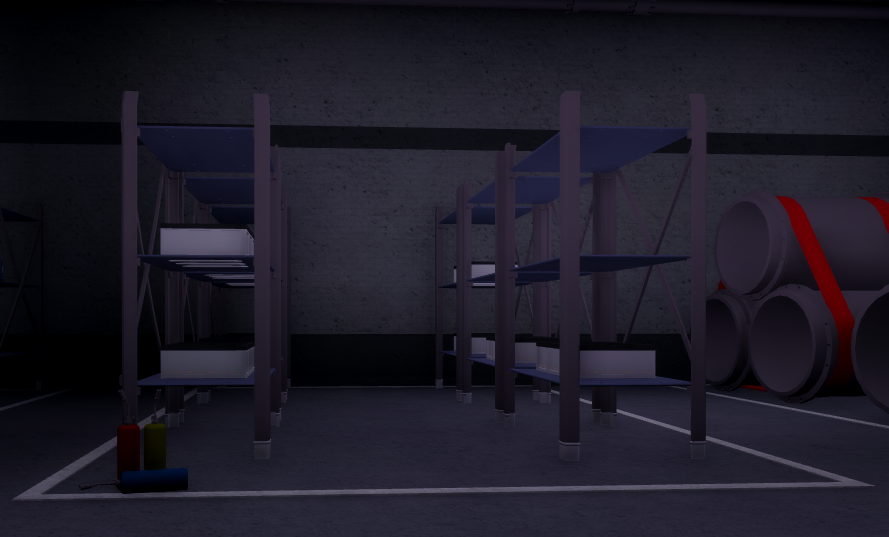
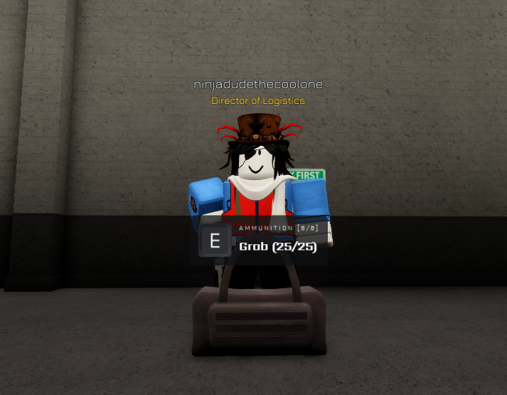

export const Highlight = ({children, color}) => (

{children}

);

The Logistics Department has a numerous amount of duties, spanning from restocking simple vending machines all the way to the transportation of important materials to actively maintain the functions of the installations and across its many sites. Below are the multiple assigned tasks that are responsible for being completed by Logistical personnel:

:::info
Colour Code below:
- <Highlight color="#ED820E"> Training Required </Highlight>
- <Highlight color="#7851a9"> Rank Required </Highlight>
- <Highlight color="#F9D71C"> Sub-Departmental Duty </Highlight>  
- <Highlight color="#FF0000"> Logistics Department Command Duty </Highlight>
- <Highlight color="#808080"> Work In Progress/Unavailable </Highlight> 
:::

## Resource Transportation - <Highlight color="#ED820E"> Training Required </Highlight>
As a member of the Logistics Department you will primarily focus on the transportation of resources and supplying the Engineering & Technical Services with the parts required to uphold Dark Matter Reactor operations. There are specific places you must deliver the said materials, all listed below:

| Resource Transportation | Procedures | Locations |
| ----------------------- | ---------- | --------- |
| Resource Transportation is one of the main objectives of the Logistics Department, because of this you are tasked with delivering materials from Installation Command to areas around the site. | Spawn in an Electric Utility Cart, take the requested item and place it on the back of the Electric Utility Cart and drive to the specified location to deliver the part (items are requested through the Engineering & Technical Services radio)  (It is advised that you click on this [link](http://localhost:3000/assets/images/utilitycart4-bf2b217074667bd88604f1933995e29b.PNG) to get a better view of the image) | The following are locations fundamental to this type of operation in particular: [1] **Logistics Depot** - this is located within Installation Command, this is the spawn of the Logistics Department where all resources are located for you to deliver;[2] **Technical Wing** - this is located outside of the entrance to the Clean Room (Research Wing) and where the Engineering & Technical Services spawn, a storage area is located within this wing for Logistics Department members to deliver parts such as **bolts, screws, pipes and diesel** on request; [3] **Site Alpha** - where you will drop off reactor parts such as **Reactor Fuel Rods** to the Engineering & Techical Services, it is advised you get a combative escort with you in order to deliver said parts.    |

## Resources & Materials
| Resource | Where it is located |
| -------- | ------------------- |
| Diesel  | [1] Installation Command Logistics Depot  |
| Bolt **(Item #2205)**  | [1] Installation Command Logistics Depot  |
| Conduit **(Item #8348)**  | [1] Installation Command Logistics Depot  |
| Pipes **(Item #7252)**  | [1] Installation Command Logistics Depot  |
| Screws **(Item #3285)**  | [1] Installation Command Logistics Depot  |
| Reactor Fuel Rods  | [1] Installation Command Logistics Depot - **it can only be found within the Logistics Depot** |

:::info
- It is advised that you get a combative escort when transporting these materials to Site-Alpha, all of these are essential to the operations of the Dark Matter Reactor of which powers the site and its facilities.
- It only applies to the materials stated above, below are materials that are not DMR related and can be transported at any time by Logistics Department Personnel.
:::

## Restocking Stations - <Highlight color="#ED820E"> Training Required </Highlight>
| Restocking Stations | Procedures | Locations |
| ------------------- | ---------- | --------- |
| The Logistics Department is responsible for supplying the site with ammunition and necessities such as armour. **You are permitted to restock stations at any time, you are allowed to determine when to restock stations.**| In order to restock a station you should collect the according materials from the Logistics Depot, such as the armour boxes or ammunition boxes. Bring them to the designated station (ensure you are holding the ammunition/armour box) and refill the station with the said item. | [1] Installation Command Shelf stock  |

## Personnel Transportation - <Highlight color="#F9D71C"> Sub-Departmental Duty </Highlight> 
| Personnel Transportation | Transport Bus Procedures | Man 7T / Container Truck Procedures | Locations |
| ------------------------ | ------------------------ | ----------------------------------- | --------- |
| One of the very many duties of the Logistics Department include the transportation of personnel, managed by the Department of Transportation (see the Sub Departments section). This can include the transportation of mass tests held by the Scientific Department and its researchers or even standard personnel to areas around Area-II through the means of a Transport Bus.  Upon receiving a certification to operate certain vehicles such as **the Man 7T, the Container Truck and the Transport Bus**, you will be given the ability to transport personnel to specific areas. | **Transport Bus procedures:** only you may drive the vehicle and no one else, you are expected to follow this routine: first you will stop at Site-Phi, then you will move to Site-Omicron and stop there for personnel to get off/on the bus, last of all you will head to Installation Command and drop personnel off there before continuing with the same routine __(note: if you intend to stop doing these duties/leave the game please ensure you complete the cycle and head back to Installation Command to despawn the vehicle and then leave)__. | Moving on to the **Man 7T/Container Truck procedures:** Scientific Department personnel who are conducting a mass test will request for you to transport the entirety of the attendees (spectators, guards, Class-D and so forth) to Site-Epsilon. In this time you are to pick up the test at Site-Omicron and then make your way to Site-Epsilon where you will stop outside of the Epsilon checkpoint for personnel to get off and for Mobile Task Force operatives to ensue with their default procedures. **It is advised you have a combatant escort when driving those involved in the test**. Once Epsilon checkpoint procedures have been completed you are to drive to the specified location within Site-Epsilon and ensure you are in the vehicle at all times to avoid it being stolen. | [1] Site Epsilon [2] Site Phi [3] Site Omicron [4] Installation Command     |

## Placement of Ammunition Bags - <Highlight color="#7851a9"> Rank Required </Highlight> **Logistics Officer+**
| Primary Information | Additional Regulations | Ammunition Bag |
| ------------------- | ---------------------- | -------------- | 
| **Logistics Officer+** are provided with an ammunition bag in order to provide further support for combatant personnel in certain areas that lack stations for such. You receive an ammunition bag once per life and approximately **eight** uses each, despawning after a period of **ten** minutes. Ammunition is an essential material to on-site combative personnel, it can be easily utilised by Class-Ds and thus ammmunition bags must be placed responsibly, if used inappropriately you may be warranted a penalty in turn for said actions. | **You may only use the ammunition bag upon request from the appropriate personnel (I.E combatants such as the Security Department)**, in the case that you are requested to supply a combative during a protocol you may ask for an escort to the specified location. |  |

### Ammunition Bag Priority
:::info
- The Ammunition Bag is an effective resource that could turn the tides for a combative, with that there is the responsibility of having priorities:
- Priorities are based off of where ammunition is the most available

**The Clean-Room**
- Should a combative request for an ammunition bag at the **Clean Room** you must prioritise their request over other requests
- The Clean-Room is a high priority due to the lack of ammunition stations near the check-point

**Site-Omicron**
- Main Entrance lobby area (where the desks and elevators are located)
- Upper Observational area (non combative observation)

**Site-Phi - Applies when there is Security Personnel present only**
- Specifically near the door **when** Security Department personnel are posted, if there are none then Site-Phi will be considered the lowest priority.
- Convenience for Security Department Personnel when they must be on high-alert whilst guarding Site-Phi, they are unable to move to the firing range in order to refill ammunition especially in certain scenarios such as a Yellow Ember.
:::

:::caution
Ammunition Bag Priority during protocols
- During certain protocols **excluding** Protocol Blue-Sky and Protocol Red-Heron, you may respond to ammunition requests from the following personnel:
- Ensure that you are given a proper rendezvous point to supply them with ammunition

__During Protocol Uproar__

**Mobile Task Forces**
- Higher priority than all other combatants regardless of task-force or rank

**Security Department Sub-Divisions/Command**
- Sub-divisions (or Security Department Command) receive a higher priority than Base Security Department personnel (those who are below Security Officer+ and are not in a sub-division)

**Base Security Department**
- Those who are not Security Officer+ and not in a Security Department Sub-Division
:::

## Monorails - <Highlight color="#ED820E"> Training Required </Highlight>

#### Monorail information and regulations
- When beginning a monorail service, announce it in staff radio with: __Monorail in service. Calling at: Phi, Omicron__, replacing the stations with all stations you will be calling at.
- When terminating a monorail service, announce the termination in staff radio with: __Monorail calling at Phi, Omicron terminates here__, replacing the stations with all the stations you will be calling at.
- In order to modify the speed of the monorail: press <kbd>W</kbd> in order to increment by one; and <kbd>S</kbd> in order to decrement by one.
- The maximum permitted speed is 15.
- Only four monorails may be in operation at once and must, therefore, all do the same route. It is the discretion of the highest ranking Logistics officer on-site at the time to determine the route.
- If the monorail is moving slowly, do not increase the speed past 5. This is a known bug and the speed will be corrected after a few metres.
- If requested by combatives to provide transportation, comply; ensure that all other monorails are not obstructing the track.
- All signals in tunnels must be obeyed.
- Monorail drivers must communicate to avoid collision, either by use of the E&TS radio or the Logistics Department VC

####  Station approach
 - When approaching a station, decrease the speed of the monorail to 4 at the second set of lights, should you wish to stop at the station. 
 - Prepare to stop at amber lights, as the proceeding set of lights shall be red. Wait until the lights are green before proceeding.
 - If available, attempt to align at the front position by passing the front doors of the back position at speed 3, and then decreasing to 2 or 1 as this will automatically stop and align the monorail.
 - If you are to stop at the back position, simply decrease your speed to 1 when entering the station.

#### Omicron approach
There is only one platform when approaching Omicron. Monorails should await at the Omicron station lights, if they are red, in accordance with general station approach guidance.

#### Monorail routes
| Route | Stations | Speed |
| ----- | -------- | ----- |
| Complete | Phi, DMR, Omicron, IC, Epsilon | Universal average of 8 |
| Non-reactor | Phi, Omicron, IC, Epsilon | Universal average of 8 |
| Essential | Phi, Omicron, Epsilon | 8 between Phi and Omicron, 10 elsewhere |
| High speed | Phi, Omicron | 15 from Omicron to Phi, 8 from Phi to Omicron |