export const Highlight = ({children, color}) => (

{children}

);

The Logistics Department has a numerous amount of duties, spanning from restocking simple vending machines all the way to the transportation of important materials to actively maintain the functions of the installations and across its many sites. Below are the multiple assigned tasks that are responsible for being completed by Logistical personnel:

:::info
Colour Code below:
- <Highlight color="#ED820E"> Training Required </Highlight>
- <Highlight color="#F9D71C"> Sub-Departmental Duty </Highlight>  
- <Highlight color="#FF0000"> Logistics Department Command Duty </Highlight>
- <Highlight color="#808080"> Work In Progress/Unavailable </Highlight> 
:::

## Resource Transportation - <Highlight color="#ED820E"> Training Required </Highlight>
As a member of the Logistics Department you will primarily focus on the transportation of resources and supplying the Engineering & Technical Services with the parts required to uphold Dark Matter Reactor operations. There are specific places you must deliver the said materials, all listed below:

| Resource Transportation | Procedures | Locations |
| ----------------------- | ---------- | --------- |
| Resource Transportation is one of the main objectives of the Logistics Department, because of this you are tasked with delivering materials from Installation Command to areas around the site. | Spawn in an Electric Utility Cart, take the requested item and place it on the back of the Electric Utility Cart and drive to the specified location to deliver the part (items are requested through the Engineering & Technical Services radio)  (It is advised that you click on this [link](http://localhost:3000/assets/images/utilitycart4-bf2b217074667bd88604f1933995e29b.PNG) to get a better view of the image) | The following are locations fundamental to this type of operation in particular: [1] **Logistics Depot** - this is located within Installation Command, this is the spawn of the Logistics Department where all resources are located for you to deliver;[2] **Technical Wing** - this is located outside of the entrance to the Clean Room (Research Wing) and where the Engineering & Technical Services spawn, a storage area is located within this wing for Logistics Department members to deliver parts such as **bolts, screws, pipes and diesel** on request; [3] **Site Alpha** - where you will drop off reactor parts such as **Reactor Fuel Rods** to the Engineering & Techical Services, it is advised you get a combative escort with you in order to deliver said parts. 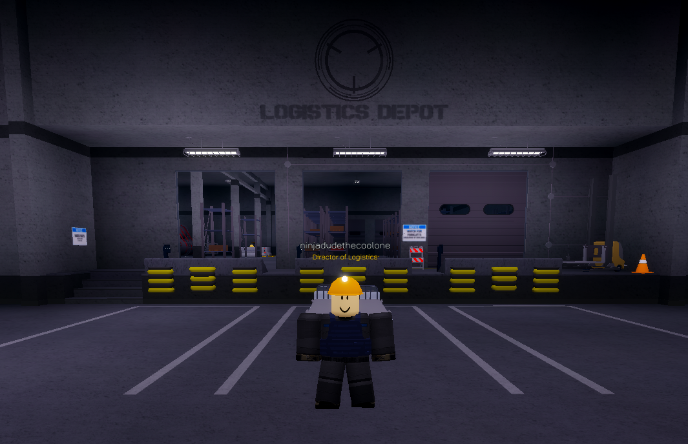  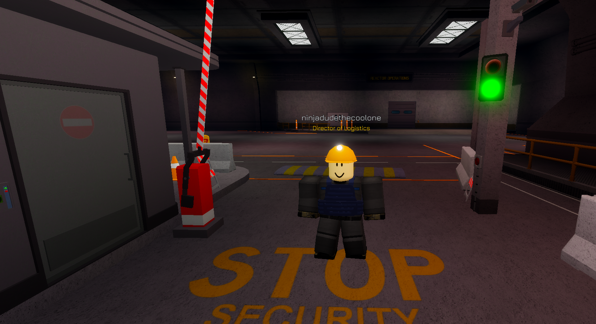 |

## Resources & Materials
| Resource | Where it is located |
| -------- | ------------------- |
| Diesel 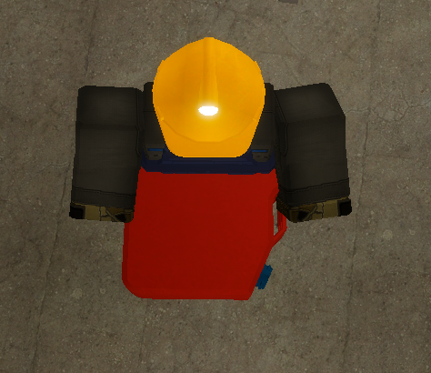 | [1] Installation Command Logistics Depot [2] Technical Wing ET&S Storage 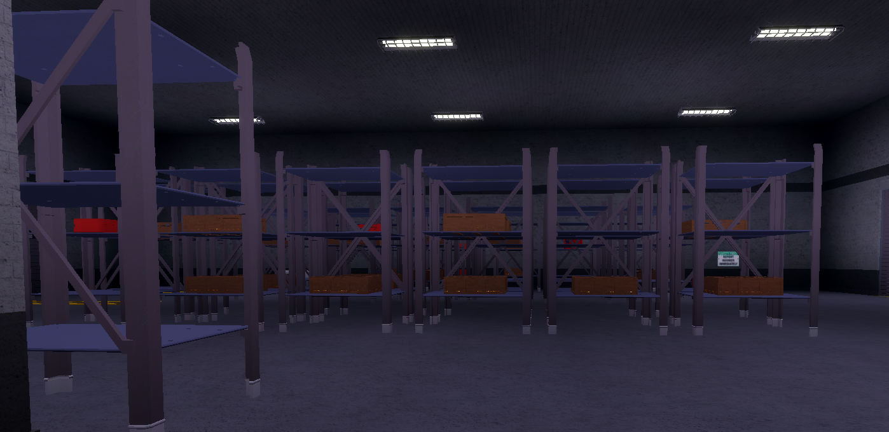 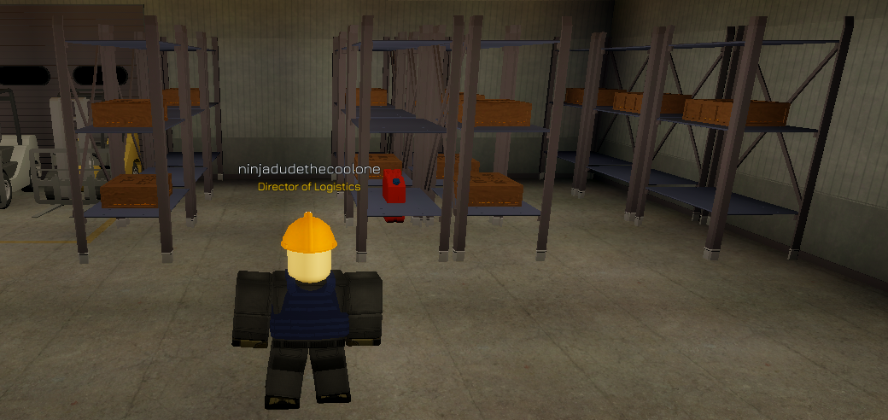 |
| Bolt **(Item #2205)** 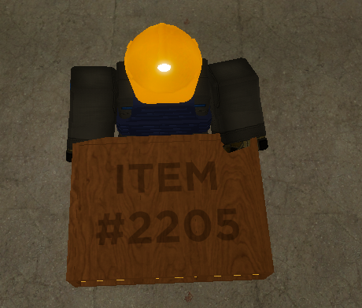 | [1] Installation Command Logistics Depot [2] Technical Wing ET&S Storage   |
| Conduit **(Item #8348)** 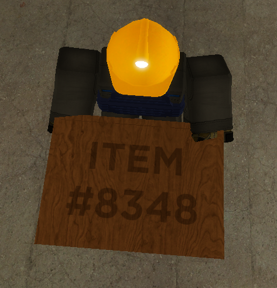 | [1] Installation Command Logistics Depot [2] Technical Wing ET&S Storage   |
| Pipes **(Item #7252)** 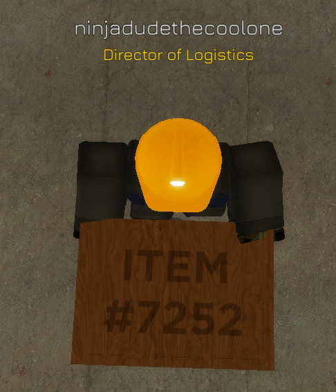 | [1] Installation Command Logistics Depot [2] Technical Wing ET&S Storage   |
| Screws **(Item #3285)**  | [1] Installation Command Logistics Depot [2] Technical Wing ET&S Storage   |
| Reactor Fuel Rods 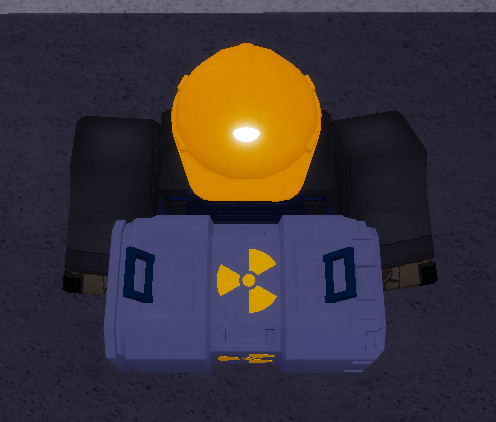 | [1] Installation Command Logistics Depot - **it can only be found within the Logistics Depot** 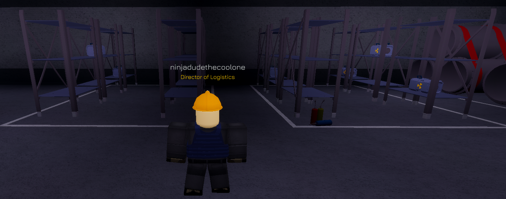|

## Restocking Stations - <Highlight color="#808080"> Work In Progress/Unavailable </Highlight> 
| Restocking Stations | Procedures | Locations |
| ------------------- | ---------- | --------- |
| <Highlight color="#808080"> Work In Progress/Unavailable </Highlight> | 

## Personnel Transportation - <Highlight color="#F9D71C"> Sub-Departmental Duty </Highlight> 
| Personnel Transportation | Transport Bus Procedures | Man 7T / Container Truck Procedures | Locations |
| ------------------------ | ------------------------ | ----------------------------------- | --------- |
| One of the very many duties of the Logistics Department include the transportation of personnel, managed by the Department of Transportation (see the Sub Departments section). This can include the transportation of mass tests held by the Scientific Department and its researchers or even standard personnel to areas around Area-II through the means of a Transport Bus.  Upon receiving a certification to operate certain vehicles such as **the Man 7T, the Container Truck and the Transport Bus**, you will be given the ability to transport personnel to specific areas. | **Transport Bus procedures:** only you may drive the vehicle and no one else, you are expected to follow this routine: first you will stop at Site-Phi, then you will move to Site-Omicron and stop there for personnel to get off/on the bus, last of all you will head to Installation Command and drop personnel off there before continuing with the same routine __(note: if you intend to stop doing these duties/leave the game please ensure you complete the cycle and head back to Installation Command to despawn the vehicle and then leave)__. | Moving on to the **Man 7T/Container Truck procedures:** Scientific Department personnel who are conducting a mass test will request for you to transport the entirety of the attendees (spectators, guards, Class-D and so forth) to Site-Epsilon. In this time you are to pick up the test at Site-Omicron and then make your way to Site-Epsilon where you will stop outside of the Epsilon checkpoint for personnel to get off and for Mobile Task Force operatives to ensue with their default procedures. **It is advised you have a combatant escort when driving those involved in the test**. Once Epsilon checkpoint procedures have been completed you are to drive to the specified location within Site-Epsilon and ensure you are in the vehicle at all times to avoid it being stolen. | [1] Site Epsilon [2] Site Phi [3] Site Omicron [4] Installation Command 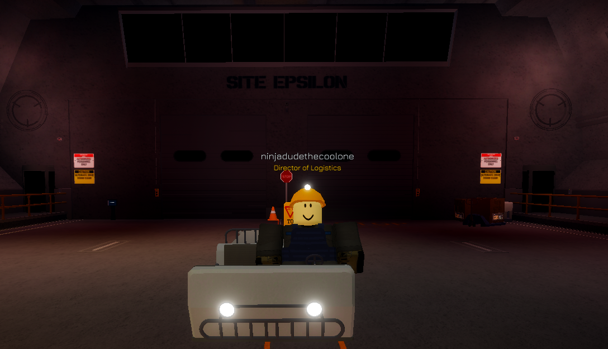 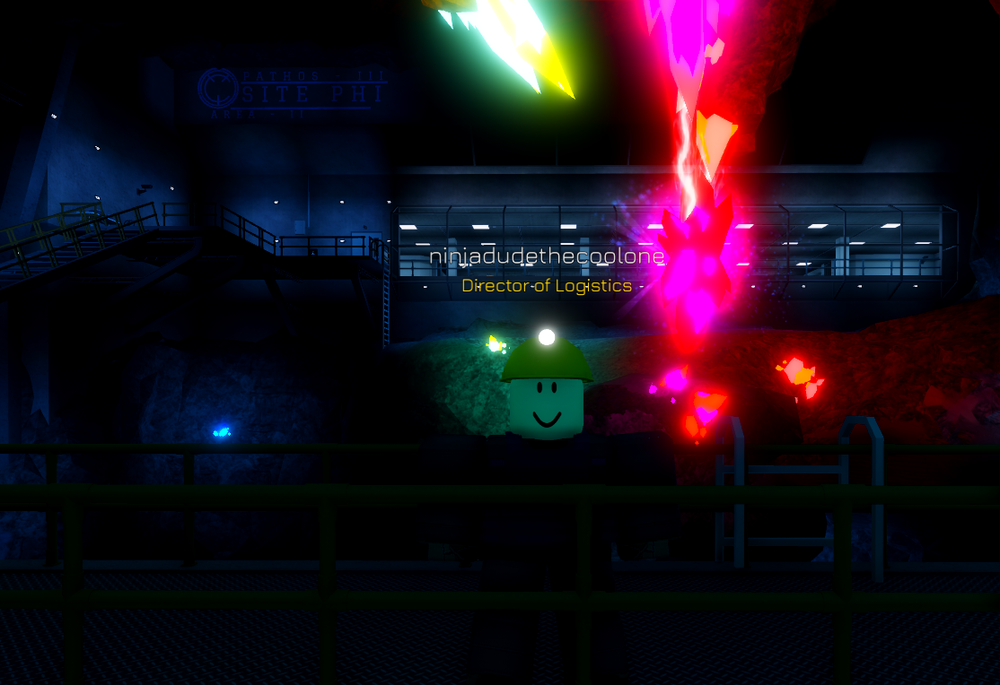 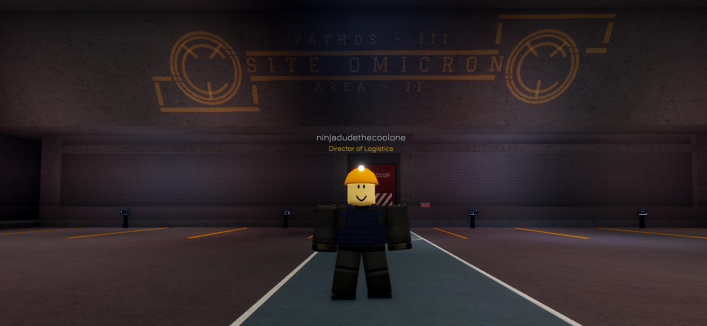 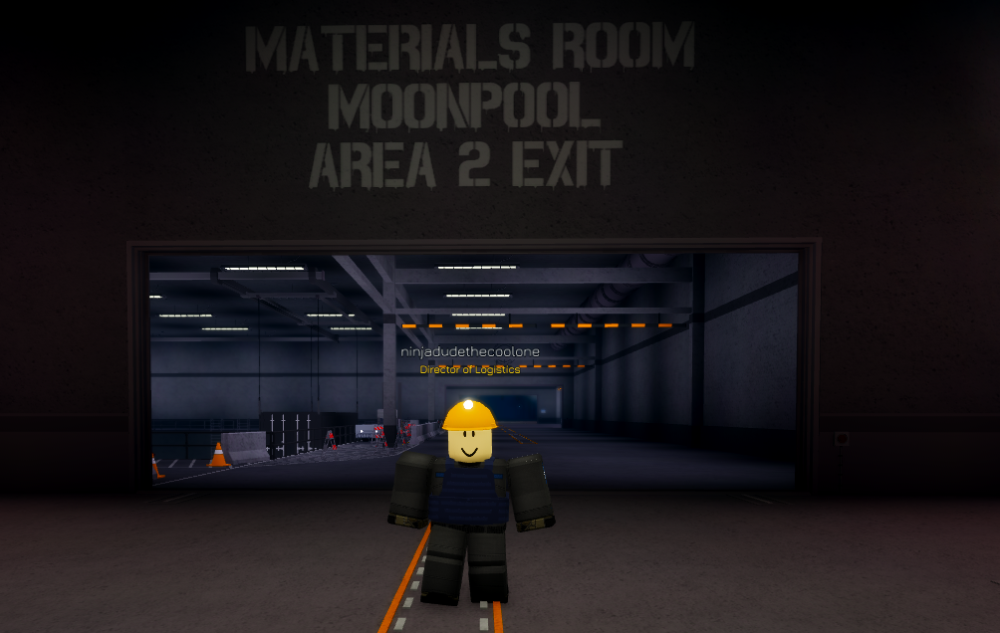 |