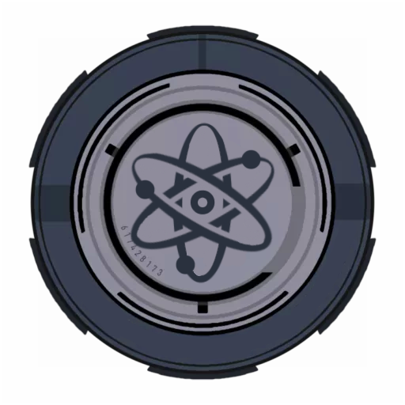

## Engineering & Technical Services
| Department | Relation |
| ---------- | -------- |
| Engineering & Technical Services  | The Engineering & Technical Services can be considered a sister-department to the Logistics Department, as is the Department of Internal Affairs to the Ethics Committee. Logistics Officers work directly with Engineers in order to accomplish the goal of maintaining the site through supplying them with the necessary materials in order to accomplish this meanwhile Engineering & Technical Services personnel are utilising the steady flow of resources created by the Logistics Department in order to install parts such as reactor-rods (otherwise referred to as the Reactor Fuel Rods) to keep the Dark Matter Reactor up and running. _"The Engineering & Technical Services department is responsible for ensuring the upkeep of all Installation technology. This department ensures the technical satisfaction of all on-site generator and power systems, as well as general facility status. The department also manages the Dark Matter Reactor & Orbital Cannon."_ |

## Reactor Operations
| Department | Relation |
| ---------- | -------- |
| Reactor Operations  | The Reactor Operations group is a collaborative group between the site's security forces, Crimson-9 Operatives, Engineering & Technical Services staff and Logistics personnel of which centralises around the running of the Dark Matter Reactor on-site efficiently, it acts as a means of communication between personnel concerned with the DMR (Dark Matter Reactor). This will also mean that the reactor is considered a priority for the Logistics Department, in turn ensuring that the flow of resources is directed towards the operations of the reactor - a major part we play is transporting materials such as pipes, conduits, bolts and even fuel for the Engineering & Technical Services personnel to install. _"The reactor is in no way a safe job, and operations can quickly go out of control without proper maintenance. Given the fact that the Dark Matter Reactor has the potential to create a black hole, evacuations are sometimes necessary. Installation Command is always open in these more dire situations. As such, individuals who maintain the Dark Matter Reactor and the energy it provides are well trained in their position of specialization."_ | 

## Mobile Task Forces - Crimson-9 
| Department | Relation |
| ---------- | -------- |
| Crimson-9  | Crimson-9 originates from the Mobile Task Forces as a recontainment based task force rather than being combat-orientated - regardless of all Mobile Task Force operators being this by default. They receive a priority in the defense of the Dark Matter Reactor within Site-Alpha of which is naturally affiliated with the Logistics Department due to the nature of our tasks - you are permitted to request for a Crimson-9 Operative to escort you whilst transporting parts of the Dark Matter Reactor. _"Crimson 9 is a containment task force that specialized is universal containment. Crimson 9 is not bound to containing any specific type of anomalies. When not deployed to any specific location, Crimson 9 handles various different types of naval tasks."_ |

:::caution
- A reminder that Logistics Department personnel are representing all of these joint relations whilst on-site or anywhere that is correlated to these groups, committing an infraction could tarnish the relation between all of these departments.
:::