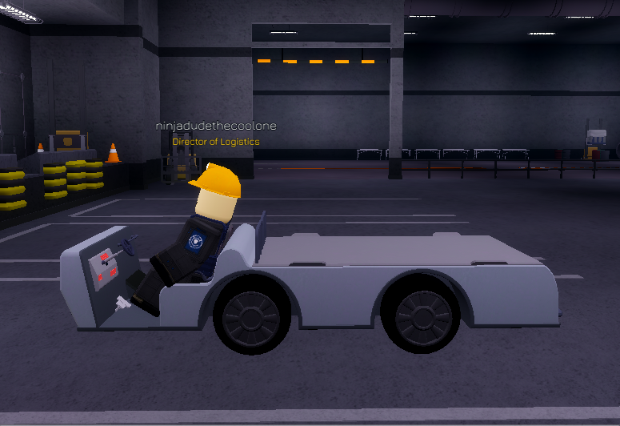
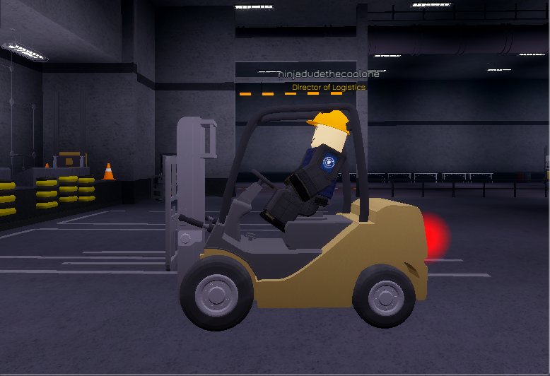
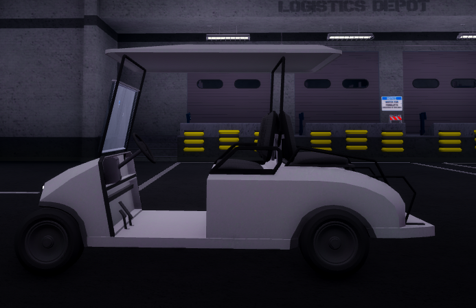
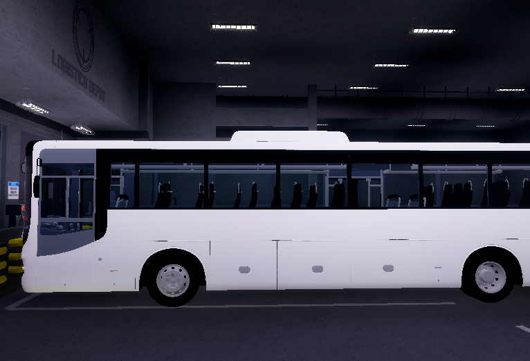
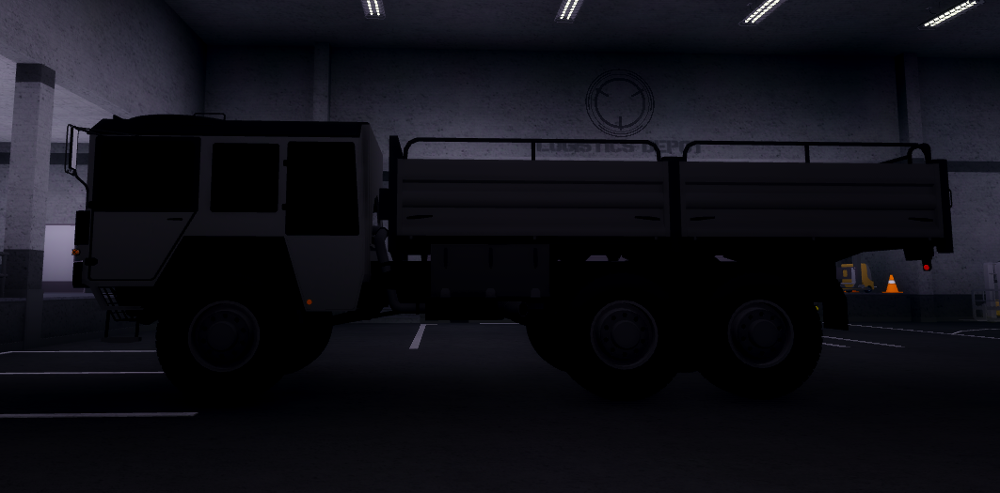
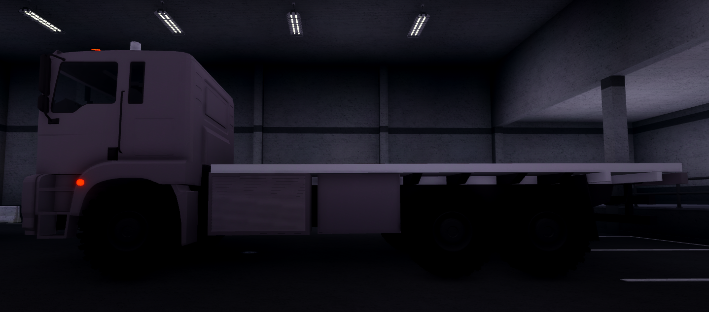

export const Highlight = ({children, color}) => (

{children}

);

Personnel within the Logistics Department at the <Highlight color="#00C09A">entry rank (of Entrant Logistics Officer)</Highlight> 
have been supplied with access to using the following vehicles in order to perform their duties efficiently:

## Vehicles Supplied
| Vehicle       | Can be accessed by    | Regulations  |                                                                                                                                                                                                                                                                                                                                                                                                                                                                                                                                                                                                                                 |
| -------------- | ------------------ | ----------------- |
| Electric Utility Cart     | Entrant Logistics Officer+ | The Electric Utility Cart is to be used for transportation and delivery of materials & parts for the Engineering & Technical Services to use, otherwise it is to be used for its intended purpose only if on official business within the site.     | 
| Forklift     | Entrant Logistics Officer+ | The main use of the Forklift is for the transportation of materials, it is advised to use the Electric Utility Cart instead, you are required to abide by road regulations nevertheless.     | 
| Golf Cart | Entrant Logistics Officer+ | The Golf Cart is permitted to be used freely, this is to be used for general transportation of personnel in order to traverse the site. A reminder that you are required to abide by the road laws set by the Ethics Committeee.  |
| Transport Bus     | Certification Required | The Transport Bus is used as a convenient way for other foundation personnel to traverse areas around the site, a certification within the HELIX system is mandatory in order to utilise this (meaning you are prohibited from driving the bus without a certification)   | 
| Man 7T | Certification Required | The Man 7T truck is to be utilised for transporting tests that are conducted by the Scientific Department, you may only use this upon request from the appropriate personnel who are authorised to do so. In order to operate the Man 7T you require a certification within the HELIX system, penalties will ensue if you do drive the vehicle without a certification/authorisation  |
| Container Truck | Certification Required | The Container Truck can only be utilised if you have a certification within the HELIX system, the Container Truck allows for Logistics personnel to store multiple supplies on the vehicle's allocated material storage area at the back. Typically this is used for larger delivery requests by the Engineering & Technical Services, it is **advised** that you get a combative escort to avoid items being stolen.  |

:::warning

- In order to utilise some vehicles you may require a certification through the means of the HELIX bot, otherwise you may receive penalties if you do not meet the requirements to drive said vehicle!
- You are prohibited from driving any of these vehicles whilst off of the team, a penalty will be warranted if you decide to do so!
:::

:::info
- Currently you are unable to drive the Forklift, however, this will be fixed in due time.
:::