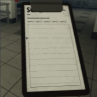
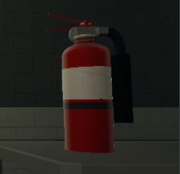

| Clipboard                                                                                                                            | Tool Description                                                                                                                                                                                                                                                                   |
|--------------------------------------------------------------------------------------------------------------------------------------|------------------------------------------------------------------------------------------------------------------------------------------------------------------------------------------------------------------------------------------------------------------------------------|
|                  | Clipboards are used to store notes and important medically-related content.  Using the clipboard in order to bypass the filter or type classified information will result in punishment.                                                                                           |
| Fire Extinguisher                                                                                                                    | Tool Description                                                                                                                                                                                                                                                                   |
|  | Fire Extinguishers are mostly used to contain SCP-457 during breaches, which means that Medical Employees are prohibited from carrying it unless;  - There is a fire in the research bay with no Mobile Task Force Operatives available. Otherwise, it cannot be equipped or used. |