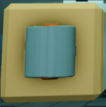
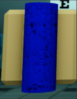
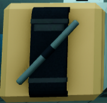
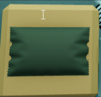
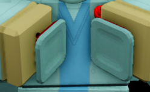

The Medical Department is at the forefront of the health of Foundation Employees. Due to this, they are given important tools that help in their duties. These tools are the following:

<strong>Bandage</strong> - A universal health item, able to heal many types of injuries.

<strong>Splint</strong> - An item used to heal injuries that are more moderate.

<strong>Tourniquet</strong> - An item used to heal severe injuries.

<strong>Field Bandage</strong> - To be used on yourself. Stops any bleeding from limbs.

<strong>MedGun</strong> - This item is to be used to assess injuries to yourself or other personnel. Anything from the MedGun shown in blue means that it can be healed using a Bandage. Limbs shown in yellow means that it can be healed using a Splint. Limbs shown in red (excluding the head and torso) means it can be healed using a Tourniquet. Heads and non-downed torso’s can be healed using bandages. Downed torso’s require a Defibrillator.

<strong>Defibrillator</strong> - An item used to revive downed torso’s. Can be used by Nurse+.

| If MedGun shows:                                             | You should use: |
|--------------------------------------------------------------|-----------------|
| <Highlight color="FA8072"> Red Limb (Arm/Leg)</Highlight>    | Tourniquet      |
| <Highlight color="dae000"> Yellow Limb (Arm/Leg)</Highlight> | Splint          |
| <Highlight color="007dc4"> Anything Limb</Highlight>         | Bandage         |
| <Highlight color="FA8072"> Downed Torso</Highlight>          | Defibrillator   |
| <Highlight color="FA8072"> Non-Downed Torso</Highlight>      | Bandage         |
| <Highlight color="FA8072"> Head</Highlight>                  | Head            |

### <strong>The Field Bandage is used to heal yourself, and not others.</strong>

The Medical Department’s main duty is to heal personnel who are downed from extensive injury. This ranges from civil personnel to combative personnel. There is a list in which order of personnel should be revived in:

O5 Council

🠗

Installation Director

🠗

Security Class 4

🠗

Mobile Task Forces

🠗

Security Department

🠗

Security Class 3

🠗

Security Class 2, 1, and 0

### <strong><ins>You may not use any items to heal/revive personnel shot/downed by Falcon-2.</ins></strong>