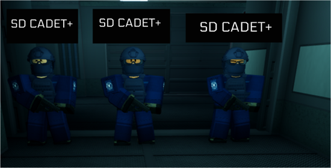
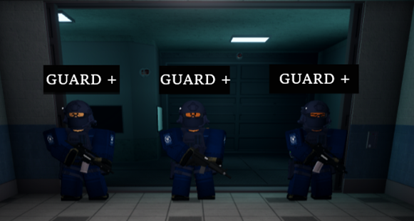

export const Highlight = ({children, color}) => (

{children}

);

The breach shelter is used when a _breached SCP has reached Site Phi, SCP-106 has breached, or when protocol Purple Reign is in effect._ It’s a safe place where Facility Personnel may take shelter during a containment breach or hostile raid. **The Military Police have full authority** over the controls and procedures of the Breach Shelter.

When the above criteria are met, you must follow these steps:

- Evacuate all Facility Personnel to the shelter.
- If the breach hasn’t been reported yet, announce in General Radio that a containment breach has occurred and all non-combative personnel should move into the Breach Shelter immediately.
- Once non-combatives begin to mobilize, you are to guide them into the Breach Shelter accordingly.
- Once the door behind you closes, you are **NOT to leave** unless authorized by an _Officer or above_.

As you may also know, inside the Breach Shelter there’s a Control Room. The Control Room operates both heavy gates for the Breach Shelter, and is the only room that should take the most priority other than standard formations. The control room must be manned at all times when the Breach Shelter is in use. If you are operating the Control Room and you have to leave, make sure someone takes your position first. The Breach Shelter control room should be operated by MP TrC+, and no more than 2 people should be allowed inside when the Breach Shelter is in use. Cadets/Junior can operate the control room if supervised by a MP Jr. Cons/Sentry or above. At least one or more Security Junior+/MP TrC+ should be inside the inner part of the Breach Shelter in case the control room operator needs to be replaced.

The Control Room manager also has a few important steps to proceed with.
Once they have arrived into the Breach Shelter, a specified countdown will begin.

:::info

- If it is a minor breach (1 hostile SCP), you should do a **90 seconds** countdown.
- If it is a severe breach (2 or more hostile SCPs out, recontainment forces having general issues), you should do a **60 seconds** countdown.
- If it is a massive breach (multiple hostile sentient SCPs at their maximum capability + inability for any recontainment forces to succeed), you should do a **30 seconds** countdown.
- If said Hostile SCP is within the premises of site Phi. A **20-30 seconds** countdown should be initiated.

:::

Once the countdown has finished, both gates are to be permanently closed until further advice. SC-4+, SRU, MTF, and MP personnel can bypass this and request for the gates to be opened, as long as they are closed once they enter.
Once the all-clear signal is given, the Control Room manager may open both gates for everyone to exit.

Any SD left out after the countdown are to station themselves nearby the BS entrance.

Breach Shelter formations are as follows:

- <Highlight color="#0084ff">Blue: Primary Formation</Highlight>

- <Highlight color="#e13238">Red: Secondary Formation</Highlight>

:::note
If all positions are filled, return to the Security Department spawn.
:::

