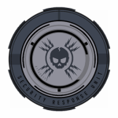

## Subdivisions

The Security Department has 3 branches (or subdivisions) each with their own unique set of duties and abilities. Some subdivisions may hold more prestige than the others, but all three of them are essential to Security operations.

| Logo                       | Department                 | Description                                                                                                                                                                                                                                                                              | Entry Form              | Cap |
| -------------------------- | -------------------------- | ---------------------------------------------------------------------------------------------------------------------------------------------------------------------------------------------------------------------------------------------------------------------------------------- | ----------------------- | --- |
|  | **Security Response Unit** | The purpose of the Security Response Unit (SRU) is to prioritize riots and to keep Site Omicron under control. SRU also responds to all Security Class 3 and below hostage situations, rogue personnel & containment breaches. SRU has advanced equipment to deal with these situations. | Application + Tryouts   | 50  |
|   | **Military Police**        | The purpose of the Military Police (MP) is to guard the main Phi/Omicron & Epsilon checkpoints as well as enforcing road laws & securing Site Epsilon and its assets.                                                                                                                    | Application + Interview | 80  |
|   | **Combat Medics**          | The Combat Medics (CM) are a subdivision of the Security Department that is responsible for ensuring the welfare of combative personnel during on-site situational events such as riots, raids, and other operations                                                                     | Applications only       | 150 |

## Divisional Inspectors

The Divisional Inspectors are responsible for providing their oversight among all subdivisions, acting as a overwatch command, ensuring they’re all functioning correctly, and making any necessary changes to the sub-division. They have more authority then the subdivision leaders, although don’t intervene unless absolutely necessary. Do not contact them for matters easily solvable by sub-divisional command.
The Divisional Inspectors may only be the Security Chiefs.

## Other Information

The following section consists of miscellaneous information, important to all security personnel. They are required to follow and enforce. These rules and regulations are implemented to maintain the structure and professionalism of our department.

:::note
Security personnel are not bound by any form of **OoS (Oath of Silence)**. Thus, may freely speak with Foundation Personnel and even Class-Ds. However, Professionalism while conversing should be maintained.
:::

- Security personnel are only allowed to use their sub divisional armour together with its respective uniform, and vice versa.

- Security personnel are able to drive vehicles they can access while on the SD team.

- Security personnel are not to ask SCP-662 for items unless they hold the rank of Security Officer and above. This should only be when necessary.

- Security personnel are encouraged to use voice channels while on-duty. This is not required, yet it is heavily recommended for enhanced communication.

- Zipties should only be used for their intended purposes. Such being testing, solitary confining Class D and detaining rogue personnel.

  :::info Zip tie controls

  - **Detain/Undetain** - `LMB`
  - **Disarm** - `Hold F + LMB`
  - **Force Jump** - `Hold Q + LMB`
  - **Show ID** - `Hold R + LMB`

- The usage of the **pepper spray** should be limited as we have weaponry to deal with most of the situations we respond to, due to this, slight restrictions/usage of the tool has been made. It is preferred to only use the pepper spray in these situations;

  - CD is standing on the yellow line at the main guard line.
  - If a CD attacks another SD with his fist.
  - If you are allowed to use it in your sub-division for sub-divisional duties only.
  - CDs are stacking on each other.
  - Do NOT use it on Class-D Juggernauts.

- Security personnel are not allowed to drink soda or consume pizza while on duty.

- Security personnel are allowed to break windows to respond to a situation, in dire need of their attention. For example, you are stationed in upper observation, and the main guard line has fallen.
- Ensure to guard the window broken, to ensure no FPs/CDs enter inaccessible areas by them.

- Guard and above are given access to smoke grenades. Only in the following are you allowed to use this;
  - The tool has been given authorization from SRU, MTF, or a Security Officer+.
  - The Installation is undergoing an Uproar, and the usage of the smokes will allow for an advantage to the foundation.
  - CM/F-2 have authorized the usage to cover the process of healing personnel.
  - Alongside this, the following must be true for the usage to be allowed;
    - Does not disrupt the duties of any Foundation personnel, particularly civil departments and enforcement divisions.
    - May not be used in any spawn, includes the SD spawn, civil departmental spawns, and the CD cells.
    - Base SD may not use smoke grenades to mask hostages
